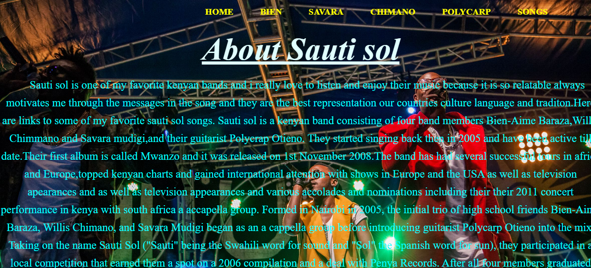
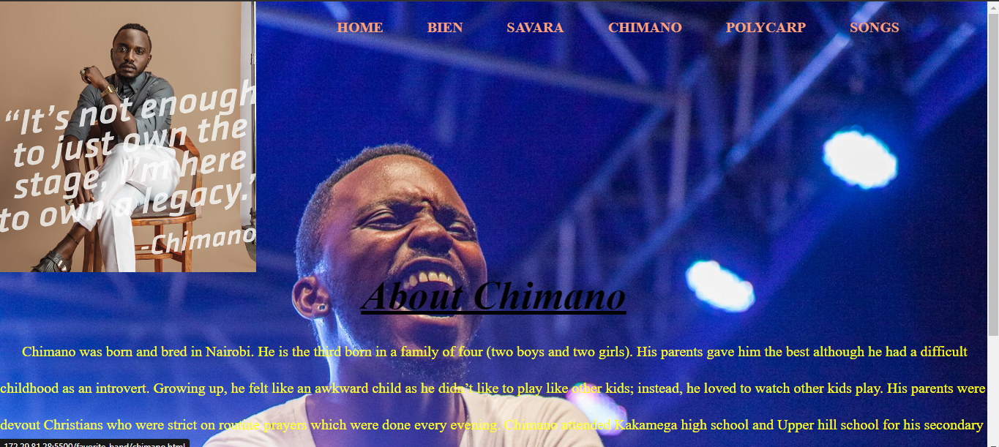

# Favoite Band Website 
This is  a HTML and CSS website that talks about one of my favorite bands which is sauti sol.The website has an introduction about the band and it has an active navigation bar that takes you to  individual pages that describe a biography of each band member including a picture of each band member,The website also has an active link to some of their best songs.
The link to the live site  https://torry7077janny.github.io/Favoritebandsautisol/ 

## TOOLS USED
The website was built with the following tools:

1.HTML

2.CSS

## PRE-REQUISITES
Inorder to be able to run the website you will need the following:

1.Windows/Linux machine

2.A github account.

3.Visual Studio code.

4.Chrome/Mozilla browser.

5.Strong internet connection

6.At least 4gb RAM.

## SETUP
These are the steps you need to follow inorder to be able to run the code in your computer/laptop:

1.Open your cgrome browser and log in to your git hub account.

2.Once you are in your github account write this repository https://github.com/Torry7077janny/Favoritebandsautisol.git  in your search box in the github account.

3.Click the blue button with the word code in it and copy this repository

4.Open your terminal and write the following:

\\\
git clone https://github.com/Torry7077janny/Favoritebandsautisol.git

\\\

5.Change the directory in your terminal to the current working directoy

6.In your terminal you will type the following:

\\\
code .
\\\ this will enable you ti open your visual studio code.

7.Once the visual studio code is open you should click on liveserver yhat should take you to the web browser you are using it could either be chrome or mozilla firefox and then you will be able to view the favorite band website.

## Screenshots
These are some of the pages in the website:

| Home                                                  | Chimano                                          |
| ------------------------------------------------------| ------------------------------------------------ |
|   |   

## AUTHOR
This website is built and maintained by Janice Kinyua.[Torry] (https://github.com/Torry7077Janny)

## ISSUES
Currently there are no known issues

## LICENSE
MIT License

Copyright (c) 2023 JANICE KINYUA

Permission is hereby granted, free of charge, to any person obtaining a copy
of this software and associated documentation files (the "Software"), to deal
in the Software without restriction, including without limitation the rights
to use, copy, modify, merge, publish, distribute, sublicense, and/or sell
copies of the Software, and to permit persons to whom the Software is
furnished to do so, subject to the following conditions:

The above copyright notice and this permission notice shall be included in all
copies or substantial portions of the Software.

THE SOFTWARE IS PROVIDED "AS IS", WITHOUT WARRANTY OF ANY KIND, EXPRESS OR
IMPLIED, INCLUDING BUT NOT LIMITED TO THE WARRANTIES OF MERCHANTABILITY,
FITNESS FOR A PARTICULAR PURPOSE AND NONINFRINGEMENT. IN NO EVENT SHALL THE
AUTHORS OR COPYRIGHT HOLDERS BE LIABLE FOR ANY CLAIM, DAMAGES OR OTHER
LIABILITY, WHETHER IN AN ACTION OF CONTRACT, TORT OR OTHERWISE, ARISING FROM,
OUT OF OR IN CONNECTION WITH THE SOFTWARE OR THE USE OR OTHER DEALINGS IN THE
SOFTWARE.

